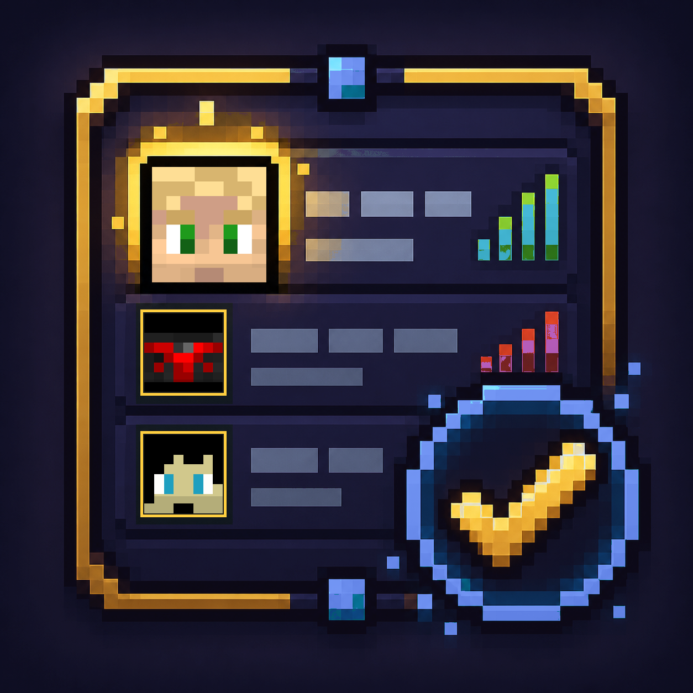

  

<h1 align="center">Legacy Tablist Heads</h1>

  Client-side Forge 1.12.2 mod that restores player head icons in the vanilla tablist.

  
  
  
  
  

## About

Legacy Tablist Heads is a lightweight client-side Forge 1.12.2 mod that restores player head icons in the vanilla tablist.

It updates the client-side tablist rendering path so player heads can render normally when skins are available on the client.

## Requirements

- Minecraft 1.12.2
- Forge 14.23.5.2847 or compatible
- MixinBooter 10.7 or newer

## Features

- Restores player head icons in the vanilla tablist.
- Client-side only.
- No server plugin is required.
- No configuration is required.
- Does not change gameplay.
- Does not modify player skins directly.

## Installation

1. Install Minecraft 1.12.2 with Forge.
2. Install MixinBooter 10.7 or newer.
3. Place `legacytablistheads-1.12.2-1.0.0.jar` in your `mods` folder.
4. Launch the game.

## Credits

- Created by Shadow-Dickinson.
- Built for Minecraft 1.12.2 Forge.
- Uses MixinBooter for client-side mixin loading.

## License

This project is licensed under the GNU General Public License v3.0. See [LICENSE](LICENSE).
